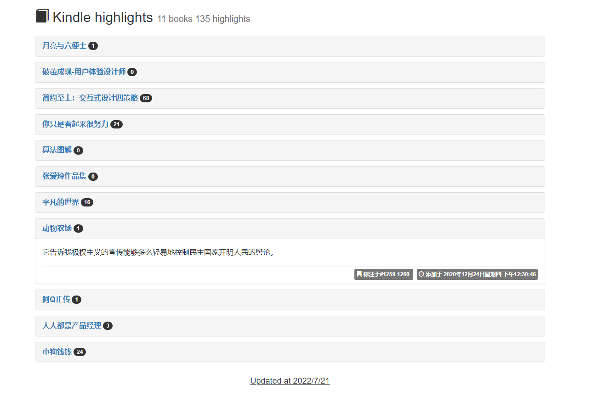
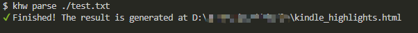

## kindle-clippings-page

This tool can convert your kindle clippings into easy-to-read web pages, and review these thoughts anytime.

## Install

- `npm install --global kindle-clippings-page`

## How to use

`khw parse <clipping file>`

Options:

- `t` or `template`: You can also write custom page if you dislike the default page.

> You can refer to the [default template](./tpl/index.html) to write this page, and view various data

## License

[MIT](https://opensource.org/licenses/MIT)
